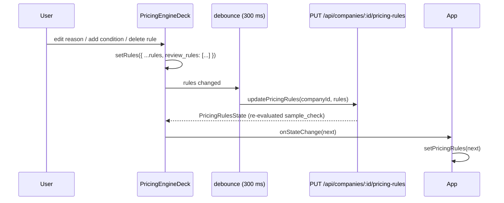

# Plan 08 — Editable "Held for Review" Rules

## Goal

The **"Held for review when"** section in Stage 4 (`PricingEngineDeck`) is currently a read-only bulleted list auto-generated by AI. Users need full structural control: add, edit, and delete review rules — with the same UX and data flow as the existing ledger variables editor.

---

## Background

`review_rules` in `PricingRules` is an array of `ReviewRule`:

```ts
interface ReviewRule { when: Cond[]; reason: string }
interface Cond { var: string; op: CompareOp; value_var?: string; value?: Cell; values?: Cell[] }
```

At Stage 5 (`generateProposal`), the pricing calculator evaluates every rule and pushes matching ones into `evaluation.needs_review`. A non-empty `needs_review` blocks the proposal from being marked "ready to send" and shows the red **Draft** box to the human reviewer.

The full `PricingRules` object (including `review_rules`) is already round-tripped through the existing `updatePricingRules` PUT endpoint. **No backend changes are needed.** This is a frontend-only change.

---

## Design Decisions (All Agreed)

| Decision | Choice |
|---|---|
| Editing level | Full structural: add, edit conditions + reason, delete |
| Save mechanism | Auto-save with 300 ms debounce (same as ledger) |
| New rule default | Empty condition (`when: []`), reason `""` (guarded by Q2/Q3 below) |
| UX expansion pattern | Click a rule row → inline tray expands below it (same as ledger variable rows) |
| Always-show section | Yes — header + "Add rule" button visible even when `review_rules` is empty |
| Downstream stale | Soft stale banner (Q1): old Stage 5 result stays, flagged "rules changed — regenerate". No wipe, no rewind. |
| Empty `when: []` | Stripped before PUT + Proceed blocked while one exists (Q2). A half-created rule can never Draft-block proposals. |
| Empty `reason` | Required: `trim(reason) !== ""`, `maxLength={200}` attr only, no counter UI (Q3). Empty → inline hint + Proceed blocked. |
| Condition editor | Extract `CondRows` to shared `CondRows.tsx` with unit filter (Q4). No cross-import from `LedgerTray`. |
| Row identity | Client-only UUID: normalize on load + on add, stripped before PUT. No backend change (Q5). |
| Validation display | Top band + red-border + auto-expand offending row via `review_rules[N]` path parse (Q6). |

---

## Resolved Question (was Open)

**Stage 5 stale clearing — RESOLVED (Q1):** soft stale banner. The old Stage 5 proposal stays on screen with a "rules changed — regenerate" flag. No wipe, no template/pricing rewind. Rationale: review edits invalidate only the last generate, not the template or variables; wiping destroys reviewer context. Keep it simple: reuse the existing notification/banner path, no new state machine.

---

## Proposed Changes

Only **two files** change. No new files, no backend touches, no new dependencies.

---

### `CondRows.tsx` (new shared module — Q4, Q5 simplicity)

Extract `CondRows` (plus `OPS`) from `LedgerTray.tsx` into `frontend/src/components/pricing/CondRows.tsx` — no other logic moves. One addition: a unit filter so review-rule LHS hides `text`/`rows` units (one `.filter()` line). `LedgerTray` imports it back (existing call sites unchanged); `PricingEngineDeck` imports from the shared path. No cross-import LedgerTray → Deck.

---

### `PricingEngineDeck.tsx`

**Imports — additions**

```diff
-import { Calculator, CheckCircle2, AlertCircle, AlertTriangle, RefreshCw, ChevronRight, Check, X, Plus, ShieldAlert, User } from "lucide-react";
+import { Calculator, CheckCircle2, AlertCircle, AlertTriangle, RefreshCw, ChevronRight, Check, X, Plus, ShieldAlert, User, Trash2 } from "lucide-react";

-import type { PricingRules, PricingRulesState, RuleVariable, ValidationError } from "../../types/pricing";
+import type { Cond, PricingRules, PricingRulesState, ReviewRule, RuleVariable, ValidationError } from "../../types/pricing";

+import { CondRows } from "./CondRows";
```
Client-only row identity (Q5): each rule carries a transient `_id` (`crypto.randomUUID()` on load-normalize + on add), stripped before PUT. Selection + error mapping key off `_id`, never the array index.

Save guards (Q2/Q3, kept minimal — no new state machine):
- Strip `when: []` rules from the PUT payload (one filter fn).
- `proceedDisabled = rules.review_rules.some(r => r.when.length === 0 || trim(r.reason) === "")`.
- Reason input gets `maxLength={200}` only — no counter UI.
- Error mapping (Q6): extend the existing `errorByPath` memo to also parse `review_rules[N]` paths → red-border + auto-expand row N. ~5 lines, no new error system.

**New state — beside `selected`**

```diff
 const [selected, setSelected] = useState<string | null>(null);
+const [selectedRule, setSelectedRule] = useState<string | null>(null); // client-only _id (Q5), not index
```

**Three helper functions — beside `editVariable` / `addHelper` (keyed by client-only `_id`, Q5)**

```ts
type EditableReviewRule = ReviewRule & { _id: string };

const editReviewRule = (id: string, r: EditableReviewRule) =>
  rules && setRules({ ...rules, review_rules: rules.review_rules.map((x) => (x as EditableReviewRule)._id === id ? r : x) });

const deleteReviewRule = (id: string) => {
  if (!rules) return;
  setRules({ ...rules, review_rules: rules.review_rules.filter((x) => (x as EditableReviewRule)._id !== id) });
  setSelectedRule(null);
};

const addReviewRule = () => {
  if (!rules) return;
  const r = { _id: crypto.randomUUID(), when: [], reason: "" };
  setRules({ ...rules, review_rules: [...rules.review_rules, r] });
  setSelectedRule(r._id); // auto-open the new rule's tray
};
```

**Replace the read-only block (current lines 327–342)**

_Before:_
```tsx
{/* Review rules */}
{rules.review_rules.length > 0 && (
  <div className="space-y-1.5">
    <div className="flex items-center gap-2 text-[11px] font-medium text-muted-foreground uppercase tracking-wide">
      <ShieldAlert className="size-3" /> Held for review when
    </div>
    <ul className="space-y-1 text-xs">
      {rules.review_rules.map((r, i) => (
        <li key={i} className="flex gap-2">
          <span className="text-muted-foreground shrink-0">{readableConds(rules, r.when)}</span>
          <span className="text-foreground">→ {r.reason}</span>
        </li>
      ))}
    </ul>
  </div>
)}
```

_After:_
```tsx
{/* Review rules — fully editable, same expand-below-row UX as ledger variables */}
<div className="space-y-1.5">
  <div className="flex items-center justify-between">
    <div className="flex items-center gap-2 text-[11px] font-medium text-muted-foreground uppercase tracking-wide">
      <ShieldAlert className="size-3" /> Held for review when
    </div>
    <button
      type="button"
      onClick={addReviewRule}
      className="inline-flex items-center gap-1 text-[11px] text-muted-foreground hover:text-foreground transition-colors"
    >
      <Plus className="size-3" /> Add rule
    </button>
  </div>

  {rules.review_rules.length === 0 ? (
    <p className="text-[11px] text-muted-foreground italic">
      No review rules yet — the AI found none. Add one if a scenario needs a human check before sending.
    </p>
  ) : (
    <div className="rounded-xl border border-border/70 overflow-hidden divide-y divide-border/40">
      {rules.review_rules.map((r, i) => {
        const isSel = selectedRule === i;
        const noConditions = r.when.length === 0;
        return (
          <React.Fragment key={i}>
            {/* Row — click to toggle tray */}
            <div
              role="button"
              tabIndex={0}
              onClick={() => setSelectedRule(isSel ? null : i)}
              onKeyDown={(e) => (e.key === "Enter" || e.key === " ") && setSelectedRule(isSel ? null : i)}
              className={`flex items-start gap-2 px-3 py-2 cursor-pointer transition-colors text-xs
                ${isSel ? "bg-muted/60" : "hover:bg-muted/30"}
                ${noConditions ? "bg-amber-500/5" : ""}`}
            >
              {noConditions && <AlertTriangle className="size-3.5 shrink-0 text-amber-500 mt-0.5" />}
              <span className="text-muted-foreground shrink-0 min-w-0 truncate">
                {r.when.length
                  ? readableConds(rules, r.when)
                  : <span className="italic opacity-60">no conditions</span>}
              </span>
              <span className="text-foreground ml-1">
                → {r.reason || <span className="italic opacity-60">no reason</span>}
              </span>
            </div>

            {/* Inline tray — same expand-below pattern as LedgerTray */}
            {isSel && (
              <div className="animate-in fade-in slide-in-from-top-1 duration-200 motion-reduce:animate-none">
                <div className="bg-muted border-border/70 p-3.5 space-y-3">
                  {noConditions && (
                    <div className="flex items-center gap-2 text-[11px] text-amber-700 dark:text-amber-400">
                      <AlertTriangle className="size-3.5 shrink-0" />
                      No conditions — this rule will flag every proposal until you add at least one.
                    </div>
                  )}

                  <div className="space-y-1">
                    <div className="text-[11px] text-muted-foreground">When (all conditions must hold)</div>
                    <CondRows
                      rules={rules}
                      items={r.when as Cond[]}
                      left="var"
                      onChange={(when) => editReviewRule(i, { ...r, when: when as Cond[] })}
                    />
                  </div>

                  <div className="space-y-1">
                    <div className="text-[11px] text-muted-foreground">Reason shown to the reviewer</div>
                    <input
                      type="text"
                      value={r.reason}
                      onChange={(e) => editReviewRule(i, { ...r, reason: e.target.value })}
                      placeholder="e.g. Franchise-scale — needs a call"
                      className="h-7 w-full rounded-md border border-border/70 bg-background px-2 text-xs text-foreground outline-none focus-visible:ring-2 focus-visible:ring-blue-500/20"
                    />
                  </div>

                  <div className="flex justify-end">
                    <button
                      type="button"
                      onClick={() => deleteReviewRule(i)}
                      className="inline-flex items-center gap-1 text-[11px] text-destructive/70 hover:text-destructive transition-colors"
                    >
                      <Trash2 className="size-3" /> Delete rule
                    </button>
                  </div>
                </div>
              </div>
            )}
          </React.Fragment>
        );
      })}
    </div>
  )}
</div>
```

**Debounced PUT — with Q2 strip**

The existing `useEffect` at line 66–81 fires on any `rules` change. Before `updatePricingRules`, strip `when: []` drafts and client-only `_id` fields. No extra wiring needed for persistence.

---

## Data Flow



---

## Edge Cases

| Case | Behaviour |
|---|---|
| Rule with `when: []` | Amber row + tray warning. Stripped from PUT (Q2); Proceed blocked until conditions added or rule deleted. Can never Draft-block proposals. |
| Rule with empty `reason` | Inline "reason required" hint, `maxLength={200}` with no counter UI (Q3). Proceed blocked until filled. |
| `selectedRule` points to a deleted index | Impossible by construction (Q5): selection keys off client-only `_id`; delete clears selection. |
| Deleting the only rule | Section falls back to empty-state hint text + "+ Add rule" button. |
| Editing a rule while PUT is in-flight | The existing `lastSaved` guard in `PricingEngineDeck` already handles this — the next debounce will catch the trailing edit. |
| Variable removed from the ledger that a review rule references | The existing backend validator (`pricing-calculator.ts` validate) will surface a `ValidationError` via the debounced PUT response. The error appears in `generalErrors`. |

---

## Files Touched

| File | Change |
|---|---|
| `frontend/src/components/pricing/CondRows.tsx` | NEW: extracted `CondRows` + `OPS` from `LedgerTray`, plus one-line unit filter hiding `text`/`rows` for review rules (Q4) |
| `frontend/src/components/pricing/LedgerTray.tsx` | Import shared `CondRows`; existing call sites unchanged |
| `frontend/src/components/pricing/PricingEngineDeck.tsx` | Imports, `selectedRule: string \| null` (`_id`), helpers keyed by `_id`, read-only list → interactive editor, Q2 strip + Q3 reason guard + Q6 row-error highlight, Q1 stale banner hook |

No backend changes. No new dependencies. Simplicity guardrail: no new state machine, no counter UI, no persisted ids.

---

## Verification Plan

### Automated tests
```bash
cd prototypes/new-auto-proposal/backend && npm test
```
No changes to backend logic or types — existing `pricing-calculator.test.ts` already covers `review_rules` validation.

### Manual verification
1. Open Stage 4 for any company after compiling pricing rules.
2. **Empty state** — compile a company that has no review rules. Confirm section is visible with "+ Add rule" button and empty-state text.
3. **Add a rule** — click "+ Add rule". New row appears, tray auto-opens, amber "no conditions" warning shows.
4. **Add a condition** — use the variable dropdowns in the tray. Amber warning disappears. Confirm "Saved ✓" appears within ~300 ms.
5. **Edit a reason** — type in the reason input. Confirm debounced save fires.
6. **Delete a rule** — open tray → "Delete rule" → row gone, save fires.
7. **Variable reference validation** — add a condition referencing a non-existent variable name (edit JSON directly via DevDock, then re-open). Confirm a validation error surfaces in the general errors band.
8. **Stage 5 check** — generate a proposal. Edit a review rule. Confirm behaviour matches the agreed decision on stale clearing.
9. **Stage 5 Draft box** — generate a proposal that triggers the edited rule. Confirm the Draft box shows the updated `reason` text.
